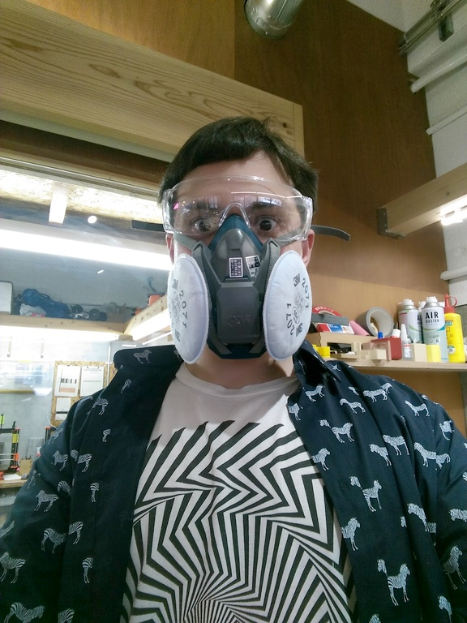
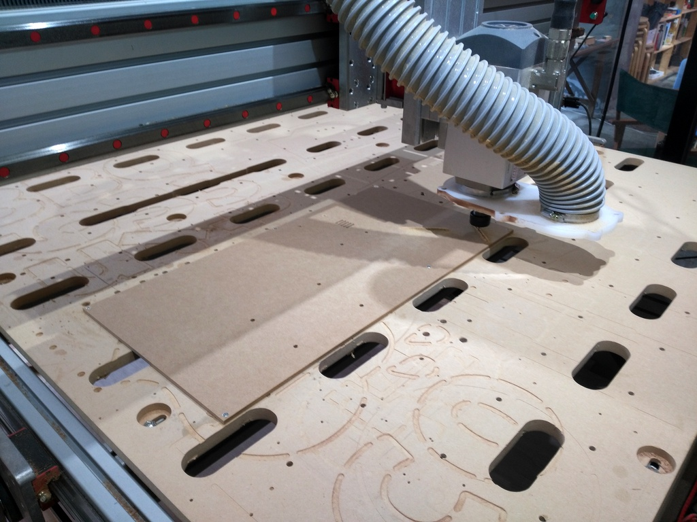
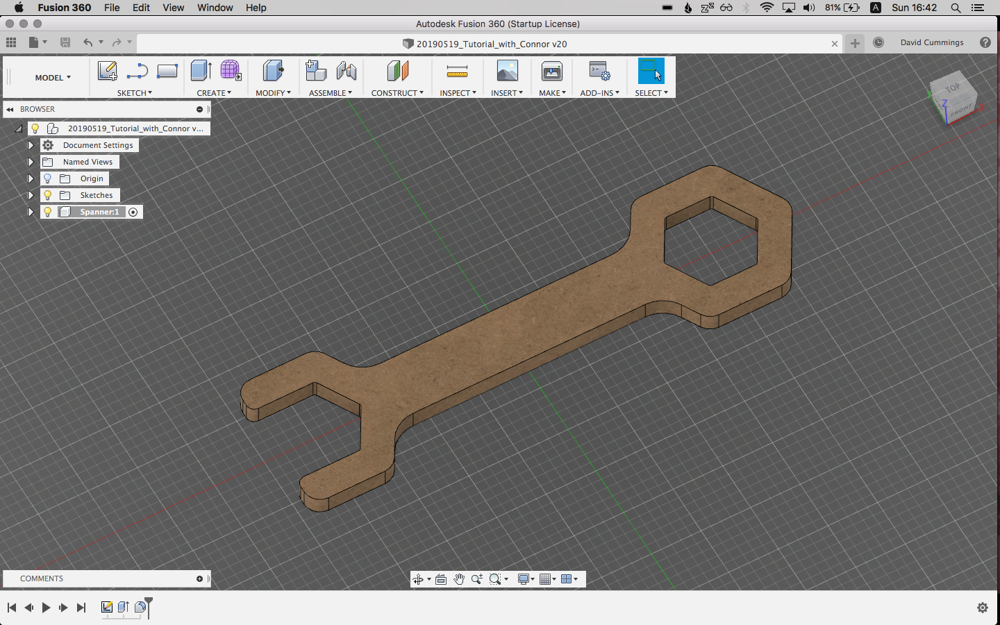
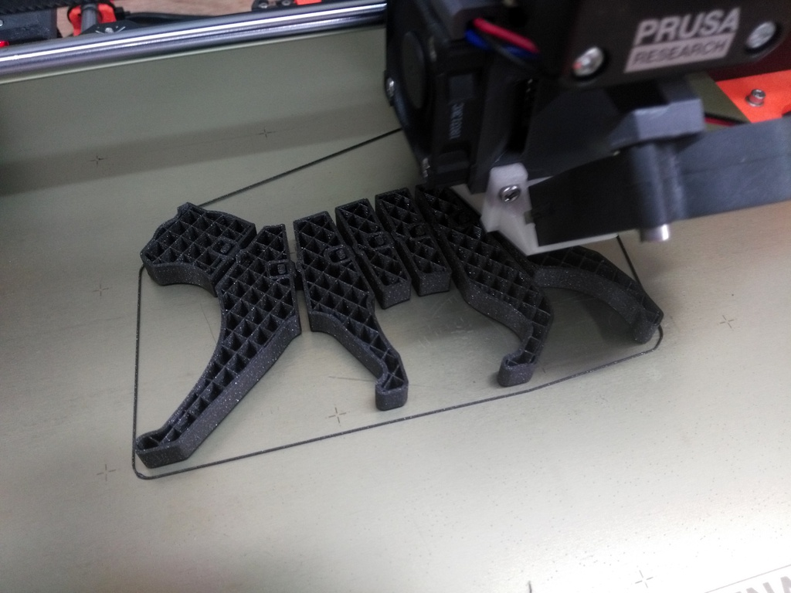
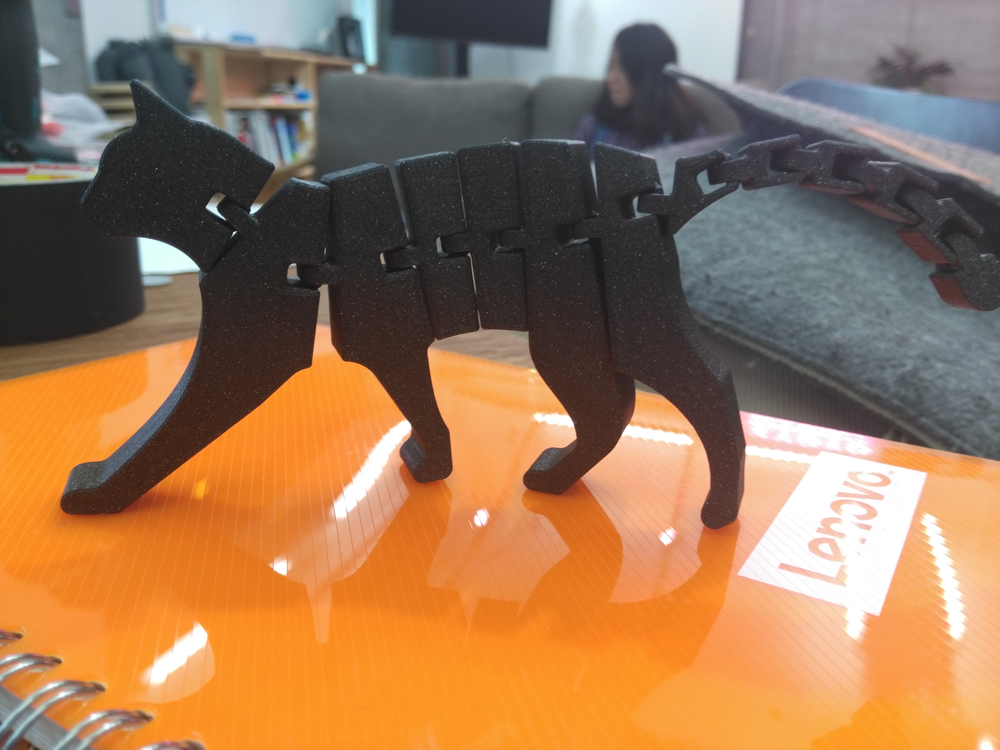

My first weekend at Kyoto Maker's Garage. The current manager, Connor, is showing me the ropes.

Day 1: Focused on our largest CNC machine, a [PRO4848](http://www.cncrouterparts.com/pro4848-4-x-4-cnc-router-kit-p-251.html) that Connor built from a kit. Kenji, one of our staff, is building a wooden car to be powered by Arduino. The wooden parts of the car will be carved out of MDF (Medium-density fibreboard) on the CNC machine.

If you don't know how a CNC machine works, like me, it basically carves shapes out of a block of material, such as wood, plastic, or even metal. Although more expensive machines can move the mill (cutting tool) in all three dimensions, the 4848 is top-down only, which means you have to do some planning ahead with your 3D model.

The basic process of CNC:

1. Design your 3D model. We use Autodesk Fusion 360.
2. Lay out the parts of your 3D model flat.
3. Create a tool path: carefully plan where the CNC machine will cut, and what endmills and drill bits you will use for each path.
4. Calibrate the machine.
5. Execute each tool path, manually changing the bit (endmill or drill bit) in between each path, and re-zeroing the Z-axis.
6. Chisel out and sand the tabs.

The most difficult part, in my opinion, was planning the tool path. There are many variables to keep in mind, such as the feeds (how much material you are cutting) and speeds (how fast the tool is moving.) You generally want to cut the inner parts out before the outer parts, to avoid pieces of material flying out. You should also use tabs to keep parts in place, and chisel+sand the tabs when finished.

Day 2: 
Connor gave an excellent tutorial on designing and modeling a part for CNC from scratch using Fusion 360. He showed us a wooden toy spanner wrench that he made for his 1-year-old daughter.

The tutorial was straightforward and easy to understand. My main takeaways, besides all the useful keyboard shortcuts, were:

1. Define as many distances as possible using User-defined Parameters, so that it's easy to adjust later.
2. Try to keep all lines or shapes constrained to each other in some way, also for easier adjusting. 
3. 'Construction' lines (dotted) are useful as guides for constraining or measuring model lines.

After lunch, I tried out one of the 3D printers, a Prusa 2.0. 3D printing is considerably easier than CNC, most times all you have to do is load a model into a slicer, slice, and print.

Things to keep in mind: layer height, amount of infill, type of filament, and the shape of your model. Some models will need supports (which can be automatically generated). Most desktop 3D printers use Fusion Deposition Modeling (FDM) which works by laying one layer at a time. This means that any parts of the model which float will need supports, or they will sag. A way to get around the need for supports is to print multiple flat pieces and glue them together with superglue.

I printed a [Flexi Cat](https://www.thingiverse.com/thing:3576952) as a first project, using a sample spool of [Prusament PLA](https://shop.prusa3d.com/en/42-prusament) and 0.15 micron layer height. The smaller the layer height, the more detailed and smooth the resulting print.

Although simpler than CNC, there are still a lot of small details to keep in mind when 3D printing. I hope to ingrain all these details through experience and watching more tutorials. 

We are thinking of buying a new 3D printer, the [RailCore II 300ZL.](https://www.projectr3d.com/products/xrxofoq21t1o786l8apcuympvjmjwj-42ps7) The rail system allows it to print much more quickly and accurately than our current 3D printers, and it can also print projects of a much larger size. It comes as a kit, and I think building it will be a very educational experience. The only hurdle will be convincing our beloved CEO to provide the funds!